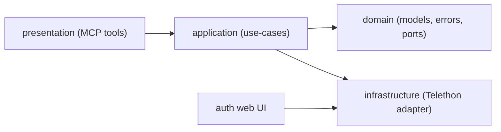

main goals:
- safe Telegram access for automation
- media proxy so agent can see images 

# telegram-mcp

Telegram MCP server for accessing your personal Telegram account from Claude Code.

## v2 highlights

- JSON-first contract for every tool.
- Cursor-based pagination for chats/messages/search/threads.
- Context and thread tools for fast LLM grounding.
- Predictable error codes:
  - `VALIDATION_ERROR`
  - `NOT_FOUND`
  - `UNAUTHORIZED`
  - `RATE_LIMITED`
  - `PROVIDER_ERROR`

## Response contract

All MCP tools return:

```json
{
  "ok": true,
  "data": {},
  "error": null,
  "meta": {
    "cursor": null,
    "has_more": false,
    "request_id": "..."
  }
}
```

Important for `stdio` mode: use `--service-ports` for `mcp`. Without published port `8902`, `get_message_media` proxy URLs will be unreachable.

By default, published Docker ports in this project are bound to `127.0.0.1` only.

For tool errors:

```json
{
  "ok": false,
  "data": null,
  "error": {
    "code": "VALIDATION_ERROR",
    "message": "from_date is required",
    "details": {
      "field": "from_date"
    }
  },
  "meta": {
    "cursor": null,
    "has_more": false,
    "request_id": "..."
  }
}
```

## Tool catalog

- `resolve_chat`: Resolve chat candidates by query (`@username`, id, title) with optional Telegram dialog filter (`dialog_filter` by name or id).
- `list_chats`: List dialogs with filters, Telegram folder selection, Telegram dialog filter selection, search, unread-only and cursor pagination.
- `list_unread_chats`: Deterministic unread triage (`unread_count`, activity) with optional Telegram folder selection.
- `list_dialog_filters`: List available Telegram dialog filters with `id`, title and peer count.
- `unsubscribe_from_channel`: Unsubscribe from a broadcast channel by `chat_id` or `@username`.
- `leave_chat`: Leave a group chat or megagroup by `chat_id`.
- `list_my_sent_chats`: Aggregate chats where you sent messages in a required time range.
- `list_mentions_to_me_chats`: Aggregate chats where messages mention your handle.
- `get_messages`: Read chat history with date range, search, order, cursor.
- `get_message_context`: Read target message with surrounding before/after messages.
- `get_thread_messages`: Read replies for a root message.
- `search_messages`: Global/per-chat search; empty query works as wildcard.
- `search_mentions_to_me`: Search messages mentioning your handle (`@username`) across chats.
- `list_replies_to_me`: Find messages that reply to your messages (global or per chat).
- `get_messages_batch`: Read several chats in one call (`chat_ids`, `limit_per_chat`).
- `list_media_messages`: Find media messages (optional `media_kind`) globally or per chat.
- `list_chat_activity_summary`: Combined per-chat activity: my messages, mentions, unread count.
- `get_chat_snapshot`: Quick chat snapshot (`recent_messages`, optional `pinned_messages`).
- `get_message_media`: Return message attachment URL (Telegram URL or signed HTTP proxy).
- `export_chat`: Export one whole chat as a single JSON payload, optionally enriched with media URLs.
- `get_auth_status`: Read-only Telegram auth status.
- `health_check`: Service/provider health diagnostics.

Every tool accepts `format="json"` (default) or `format="markdown"`.

## Chat Discovery Guide

Use these rules when a client needs to find a chat quickly and predictably:

- Use `resolve_chat(query=...)` when you need one concrete `chat_id` for later calls like `get_messages`.
- Use `list_chats(...)` when you want to browse a scope and inspect several matching chats.
- Use `dialog_filter` for custom Telegram tabs/filters created in the Telegram client.
  Examples: `Fix Price`, `Unread`, `Работа`.
- Use `folder=0` only for dialogs outside archive and `folder=1` only for archive.
  `folder` does not mean custom Telegram tab/filter.
- Do not combine `folder` and `dialog_filter` in one request.

Recommended examples:

- Discover available Telegram filters:
  `list_dialog_filters()`
- Recent normal chat by title:
  `resolve_chat(query="Engineering")`
- Chat that exists inside a custom Telegram filter:
  `resolve_chat(query="Android Group", dialog_filter="Fix Price")`
- Browse chats inside a custom filter:
  `list_chats(dialog_filter="Fix Price", query="Android")`
- Browse archived dialogs:
  `list_chats(folder=1, query="Support")`

Performance note:

- `resolve_chat(query=...)` without `dialog_filter` may scan many dialogs and filters in large accounts.
- If you know the custom Telegram filter name, always pass `dialog_filter` to reduce latency.

Time filters are supported by:
- `get_messages`
- `search_messages`
- `list_my_sent_chats`
- `list_mentions_to_me_chats`
- `search_mentions_to_me`
- `list_replies_to_me`
- `get_messages_batch`
- `list_media_messages`
- `list_chat_activity_summary`

Rules for `from_date` / `to_date`:
- Must be ISO8601 datetime with time, for example `2026-02-15T00:00:00Z`.
- Date-only values like `2026-02-15` are rejected with `VALIDATION_ERROR`.
- For `list_my_sent_chats`, `from_date` is required.
- For `list_chat_activity_summary`, `from_date` is required.

## Setup

### 1. Get Telegram API credentials

Go to https://my.telegram.org/apps, create an app, note `api_id` and `api_hash`.

### 2. Configure

```bash
cd ~/dev/tools/telegram-mcp
cp .env.example .env
# Fill API_ID, API_HASH, PHONE
```

Optional env:

- `MCP_TRANSPORT` (default `stdio`) - runtime transport (`stdio`, `sse`, `streamable-http`) for `python -m telegram_mcp`.
- `MCP_HTTP_HOST` (default `127.0.0.1`) - bind host for `sse`/`streamable-http` transports.
- `MCP_HTTP_PORT` (default `8000`) - bind port for `sse`/`streamable-http` transports.
- `MCP_MOUNT_PATH` (default `/`) - optional SSE mount prefix.
- `DIALOG_SCAN_LIMIT` (default `1000`) - upper bound for dialog scanning operations.
- `MEDIA_DOWNLOAD_LIMIT_BYTES` (default `8388608`) - max attachment size for media proxy downloads.
- `MEDIA_PROXY_HOST` (default `0.0.0.0`) - bind host for internal media proxy.
- `MEDIA_PROXY_PORT` (default `8902`) - bind port for internal media proxy.
- `MEDIA_PROXY_PUBLIC_BASE_URL` (default `http://localhost:8902`) - base URL returned to MCP clients.
- `MEDIA_PROXY_TOKEN_SECRET` (default `API_HASH`) - HMAC secret for signed media URLs.
- `MEDIA_PROXY_TOKEN_TTL_SECONDS` (default `3600`) - signed media URL lifetime.

### 3. Build

```bash
docker compose --profile auth build
```

### 4. Authenticate

```bash
docker compose --profile auth run --rm --service-ports auth
```

Open http://localhost:8901, enter phone, code, and 2FA password if needed.

### 5. Choose transport

#### Option A: stdio (default, one process per client)

```json
{
  "mcpServers": {
    "telegram": {
      "type": "stdio",
      "command": "docker",
      "args": [
        "compose", "-f", "/path/to/telegram-mcp/docker-compose.yml",
        "run", "--rm", "-i", "--no-deps", "--service-ports", "mcp"
      ]
    }
  }
}
```

`mcp` service is pinned to `--transport stdio` in `docker-compose.yml`.

If a previous `mcp` one-off container is still running, a new `docker compose run` will fail with `port is already allocated` on `8902`.

#### Option B: SSE (shared long-lived server)

Start background SSE server:

```bash
docker compose --profile sse up -d mcp-sse
```

Endpoints:

- MCP SSE endpoint: `http://localhost:8903/sse`
- Media proxy endpoint: `http://localhost:8904/media/{token}`

Claude Code example:

```json
{
  "mcpServers": {
    "telegram-sse": {
      "type": "sse",
      "url": "http://localhost:8903/sse"
    }
  }
}
```

Stop SSE server:

```bash
docker compose --profile sse stop mcp-sse
docker compose --profile sse rm -f mcp-sse
```

#### Option C: Streamable HTTP for Codex (shared long-lived server)

Start background HTTP server:

```bash
docker compose --profile http up -d mcp-http
```

Endpoints:

- MCP endpoint: `http://localhost:8905/mcp`
- Media proxy endpoint: `http://localhost:8906/media/{token}`

Codex example:

```bash
codex mcp add telegram --url http://localhost:8905/mcp
```

Stop HTTP server:

```bash
docker compose --profile http stop mcp-http
docker compose --profile http rm -f mcp-http
```

## Architecture



Layers:

- `domain/`: entities, value objects, error model, read port.
- `application/`: use-cases, validation, cursor codec, response envelope.
- `infrastructure/`: Telethon-based implementation and provider error mapping.
- `presentation/`: MCP tool exposure and markdown rendering.
- `auth/`: web flow for authorization only.

## Development and quality gates

```bash
python3 -m pip install -e .[dev]
ruff check .
mypy
pytest -q
```

CI runs the same gates plus `docker compose config` smoke check.

## Mutation boundary

This project does not expose send/edit/delete message tools.
The only write operations are explicit membership actions:
- `unsubscribe_from_channel`
- `leave_chat`
