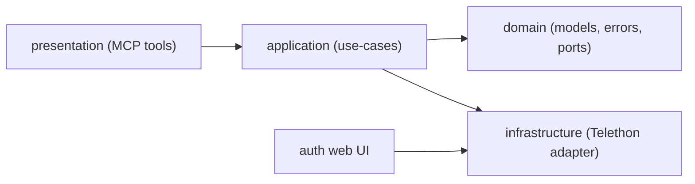

main goals:
- read-only
- media proxy so agent can see images 

# telegram-mcp

Read-only MCP server for accessing your personal Telegram account from Claude Code.

## v2 highlights

- JSON-first contract for every tool.
- Cursor-based pagination for chats/messages/search/threads.
- Context and thread tools for fast LLM grounding.
- Predictable error codes:
  - `VALIDATION_ERROR`
  - `NOT_FOUND`
  - `UNAUTHORIZED`
  - `RATE_LIMITED`
  - `PROVIDER_ERROR`

## Response contract

All MCP tools return:

```json
{
  "ok": true,
  "data": {},
  "error": null,
  "meta": {
    "cursor": null,
    "has_more": false,
    "request_id": "..."
  }
}
```

Important: use `--service-ports` for `mcp`. Without published port `8902`, `get_message_media` proxy URLs will be unreachable.

For tool errors:

```json
{
  "ok": false,
  "data": null,
  "error": {
    "code": "VALIDATION_ERROR",
    "message": "from_date is required",
    "details": {
      "field": "from_date"
    }
  },
  "meta": {
    "cursor": null,
    "has_more": false,
    "request_id": "..."
  }
}
```

## Tool catalog

| Tool                  | Purpose                                                               |
|-----------------------|-----------------------------------------------------------------------|
| `resolve_chat`        | Resolve chat candidates by query (`@username`, id, title).            |
| `list_chats`          | List dialogs with filters, search, unread-only and cursor pagination. |
| `list_unread_chats`   | Deterministic unread triage (`unread_count`, activity).               |
| `list_my_sent_chats`  | Aggregate chats where you sent messages in a required time range.      |
| `get_messages`        | Read chat history with date range, search, order, cursor.             |
| `get_message_context` | Read target message with surrounding before/after messages.           |
| `get_thread_messages` | Read replies for a root message.                                      |
| `search_messages`     | Global/per-chat search; empty query works as wildcard.                |
| `search_mentions_to_me` | Search messages mentioning your handle (`@username`) across chats.  |
| `get_chat_snapshot`   | Quick chat snapshot (`recent_messages`, optional `pinned_messages`).  |
| `get_message_media`   | Return message attachment URL (Telegram URL or signed HTTP proxy).    |
| `get_auth_status`     | Read-only Telegram auth status.                                       |
| `health_check`        | Service/provider health diagnostics.                                  |

Every tool accepts `format="json"` (default) or `format="markdown"`.

Time filters are supported by:
- `get_messages`
- `search_messages`
- `list_my_sent_chats`
- `search_mentions_to_me`

Rules for `from_date` / `to_date`:
- Must be ISO8601 datetime with time, for example `2026-02-15T00:00:00Z`.
- Date-only values like `2026-02-15` are rejected with `VALIDATION_ERROR`.
- For `list_my_sent_chats`, `from_date` is required.

## Setup

### 1. Get Telegram API credentials

Go to https://my.telegram.org/apps, create an app, note `api_id` and `api_hash`.

### 2. Configure

```bash
cd ~/dev/tools/telegram-mcp
cp .env.example .env
# Fill API_ID, API_HASH, PHONE
```

Optional env:

- `DIALOG_SCAN_LIMIT` (default `1000`) - upper bound for dialog scanning operations.
- `MEDIA_DOWNLOAD_LIMIT_BYTES` (default `8388608`) - max attachment size for media proxy downloads.
- `MEDIA_PROXY_HOST` (default `0.0.0.0`) - bind host for internal media proxy.
- `MEDIA_PROXY_PORT` (default `8902`) - bind port for internal media proxy.
- `MEDIA_PROXY_PUBLIC_BASE_URL` (default `http://localhost:8902`) - base URL returned to MCP clients.
- `MEDIA_PROXY_TOKEN_SECRET` (default `API_HASH`) - HMAC secret for signed media URLs.
- `MEDIA_PROXY_TOKEN_TTL_SECONDS` (default `3600`) - signed media URL lifetime.

### 3. Build

```bash
docker compose --profile auth build
```

### 4. Authenticate

```bash
docker compose --profile auth run --rm --service-ports auth
```

Open http://localhost:8901, enter phone, code, and 2FA password if needed.

### 5. Add to Claude Code

```json
{
  "mcpServers": {
    "telegram": {
      "type": "stdio",
      "command": "docker",
      "args": [
        "compose", "-f", "/path/to/telegram-mcp/docker-compose.yml",
        "run", "--rm", "-i", "--no-deps", "--service-ports", "mcp"
      ]
    }
  }
}
```

## Architecture



Layers:

- `domain/`: entities, value objects, error model, read port.
- `application/`: use-cases, validation, cursor codec, response envelope.
- `infrastructure/`: Telethon-based implementation and provider error mapping.
- `presentation/`: MCP tool exposure and markdown rendering.
- `auth/`: web flow for authorization only.

## Development and quality gates

```bash
python3 -m pip install -e .[dev]
ruff check .
mypy
pytest -q
```

CI runs the same gates plus `docker compose config` smoke check.

## Read-only invariant

This project does not expose send/edit/delete message tools.
All MCP operations are read-only by design.
